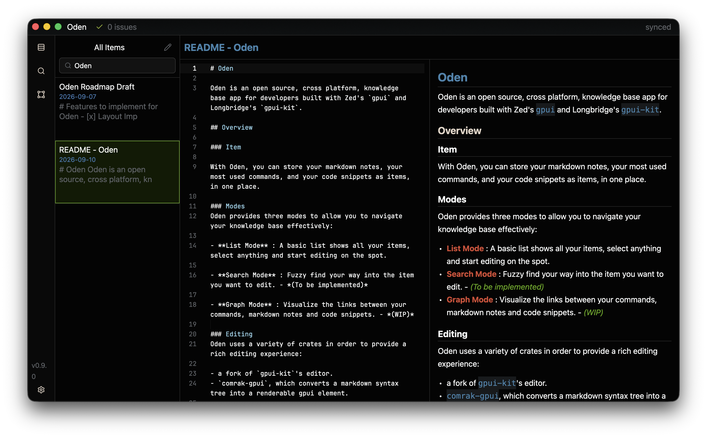
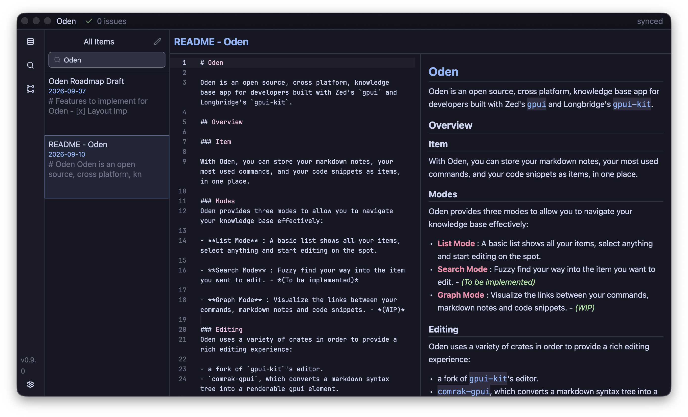
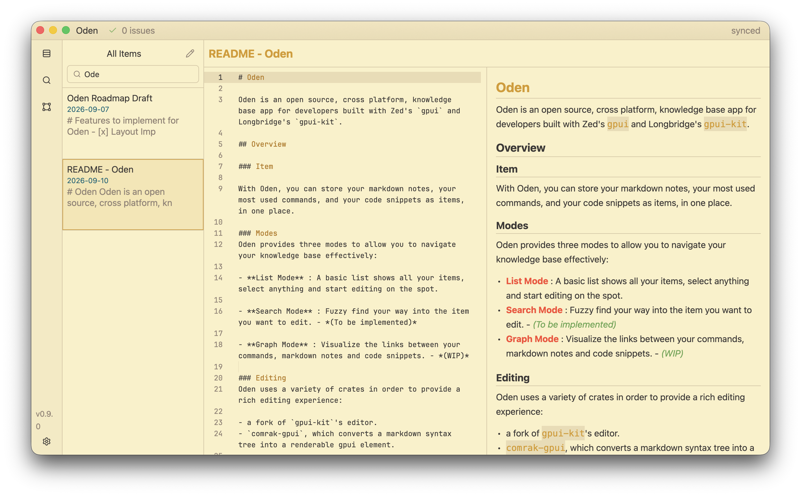

# Oden

  

Oden is an open source, cross platform, knowledge base app for developers built with Zed's `gpui` and Longbridge's `gpui-kit`. 

## Overview

### Item

With Oden, you can store your markdown notes, your most used commands, and your code snippets as items, in one place.

### Modes 
Oden provides three modes to allow you to navigate your knowledge base effectively: 

- **List Mode** : A basic list shows all your items, select anything and start editing on the spot.
- **Search Mode** : Fuzzy find your way into the item you want to edit. 
- **Graph Mode** : Visualize the links between your commands, markdown notes and code snippets. 
 
### Editing 
Oden uses a variety of crates in order to provide a rich editing experience: 

- a fork of `gpui-kit`'s editor.
- `comrak-gpui`, which converts a markdown syntax tree into a renderable gpui element.  

A vim mode is also in the works. If you are interested, check out the code [here](https://github.com/out-of-order/gpui-component/commit/ba90c680827eed4256e63d1f5f36f714bfe611f8).

### Theming
Since Oden is built on `gpui-kit`, it comes with all the themes provided by `gpui-kit`, see some examples below:

### Roadmap

Roadmap before `v1.0.0`. (High level bullet points - Check the issues pages to see what's being worked on right now).

**Editing**:  
- [ ] Toolbar with formatting support (Bold, Italic, StrikeThrough) and inserting nodes (Bullet list, Paragraph, Ordered List, Headings, and Images).
- [ ] Fully functional vim mode.
- [ ] Configurable keymaps for formatting and inserting nodes.

**Markdown Preview**: 
- [ ] Support for tables.
- [ ] Support for images.
- [ ] Sync scroll between edit and preview.
- [ ] Switch between split pane/ full preview/ full edit.

**Core Features**  
- [ ] Commands and code snippets support.
- [ ] Tag for items support.
- [ ] Keyboard only workflows.
- [ ] Configuration Support (Settings page - theming, keymaps, ...).
- [ ] Ensure cross platform support.

**Graph Mode** 
- [ ] Force directed graph layout.
- [ ] Graph interactivity. 
- [ ] Link between items are represented in the graph.

**Search Mode**
- [ ] Fuzzy finding implemented for all items.

## AI Disclaimer
This application is in no way "vibe coded". LLMs were used as tools to learn about topics, to explain encountered errors, and to help with the borrow checker, nothing more.
